# CIPHER — Physical Hacking Terminal

> A multi-stage embedded escape-room game on the STM32F103C8T6 Blue Pill. Six sensor-driven challenges, a 90-second countdown, and "ACCESS GRANTED" if you survive.

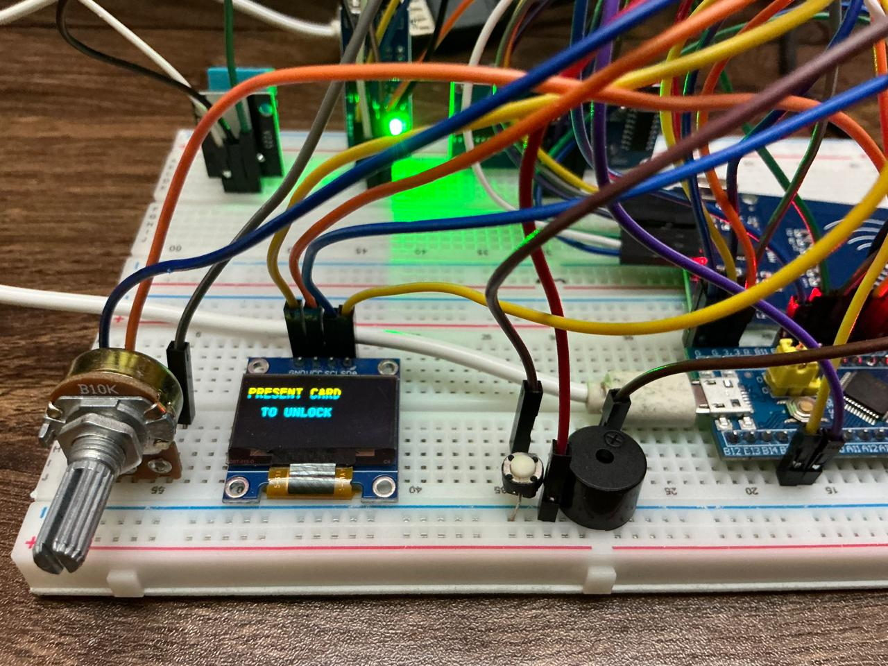

---

## Table of Contents

- [Overview](#overview)
- [Hardware](#hardware)
- [Circuit Diagram](#circuit-diagram)
- [Pin Assignments](#pin-assignments)
- [Clock & Build Configuration](#clock--build-configuration)
- [Boot Sequence](#boot-sequence)
- [The Six Stages](#the-six-stages)
- [Win & Fail States](#win--fail-states)
- [Development Screens](#development-screens)
- [Hardware Bring-Up Tests](#hardware-bring-up-tests)
- [Pin Reservations & Expansion](#pin-reservations--expansion)
- [How to Flash](#how-to-flash)
- [How to Rebuild from Source](#how-to-rebuild-from-source)
- [Build Metrics](#build-metrics)
- [Known Limitations](#known-limitations)
- [License](#license)
- [Author](#author)

---

## Overview

CIPHER (**C**hallenge-based **I**nteractive **P**hysical **H**ardware **E**scape **R**oom) is a sensor-driven embedded systems project that turns a Blue Pill, an OLED, and a fistful of sensors into a tabletop hacking game. The player wakes the terminal with a hand wave, authenticates with an RFID card, and then has 90 seconds to clear six hardware-based challenges — turning a potentiometer, holding a button, positioning an object at a target distance, dialing in a temperature reading, and entering a 4-digit passcode.

The system runs as a finite state machine driven by a hardware timer interrupt for the countdown, with six modular stage handlers dispatched from a single game loop. It exercises a representative cross-section of embedded peripherals:

- **ADC** for the potentiometer dial-in mechanic
- **I2C (Fast Mode, 400 kHz)** for the SSD1306 OLED display
- **SPI** with manual chip-select for the RC522 RFID reader
- **GPIO + DWT cycle counter** for HC-SR04 ultrasonic timing
- **1-wire bit-bang** for the DHT11 temperature sensor
- **PWM** via TIM4 for the passive buzzer
- **External interrupt / polling** for the push button and IR proximity sensor
- **Timer ISR (TIM2, 100 ms period)** for the countdown and tension-escalating buzzer cues

All six stages are verified end-to-end on hardware.

---

## Hardware

| # | Component | Qty | Role |
|---|---|---|---|
| 1 | STM32F103C8T6 Blue Pill | 1 | Main MCU |
| 2 | ST-LINK V2 Programmer | 1 | SWD flashing |
| 3 | 0.96" OLED I2C (SSD1306) | 1 | Player display |
| 4 | RFID RC522 + card | 1 | Boot authentication |
| 5 | IR proximity sensor | 1 | Wake-on-wave |
| 6 | HC-SR04 ultrasonic sensor | 1 | Stage 3 distance challenge |
| 7 | DHT11 temperature sensor | 1 | Stage 5 temperature challenge |
| 8 | 10 kΩ potentiometer | 1 | Dial-in input (Stages 1, 2, 5, 6) |
| 9 | Push button | 1 | Confirm + Stage 4 hold timing |
| 10 | Passive buzzer | 1 | Audio feedback (passive — active buzzers ignore PWM) |
| 11 | Breadboard (medium) + jumper wires | — | Wiring |
| 12 | Resistors | several | 4.7 kΩ pull-up for DHT11, others |
| 13 | 100 nF ceramic capacitor | 1 | Decoupling on RC522 VCC (eliminates SPI dropouts) |

### Critical hardware notes

- **RFID RC522:** 3.3 V **only**. 5 V will permanently damage the module. The `IRQ` pin is left unconnected. For reliable scans, use direct male-to-female jumpers between the Blue Pill and the module (breadboard parasitics cause intermittent failures) plus a 100 nF cap across VCC/GND on the module side.
- **HC-SR04:** Requires **5 V** supply — 3.3 V won't trigger the ultrasonic transducer. ECHO returns at 5 V logic but PA8 is 5 V-tolerant, so no level shifter is needed.
- **IR sensor:** Active LOW (output goes LOW when something is detected). Use 5 V supply — at 3.3 V the detection range drops too low for reliable wake. Adjust the on-board sensitivity trim pot until the indicator LED is OFF in still air and ON when a hand passes.
- **DHT11:** Requires a **4.7 kΩ pull-up** from data line (PB0) to 3.3 V. Without it, the first read may succeed but subsequent reads will fail. Two 10 kΩ resistors in parallel work if you don't have 4.7 kΩ on hand.
- **OLED:** I2C1 must be in **Fast Mode (400 kHz)**. Standard Mode (100 kHz) results in a silent rendering failure on the clone SSD1306 modules I tested. The yellow top strip + blue bottom on the panel is a two-colour OLED feature, not a bug.
- **Buzzer:** Must be **passive**. Active buzzers self-oscillate at a fixed frequency and ignore the PWM input entirely.

---

## Circuit Diagram

The full wiring diagram is in [`cipher_circuit_diagram.svg`](cipher_circuit_diagram.svg) at the repo root — open it in any browser or vector editor for a zoomable view.

---

## Pin Assignments

| Pin | Mode | Pull | Connected to |
|---|---|---|---|
| PA0 | ADC1_IN0 | — | Potentiometer wiper |
| PA1 | GPIO_Input | Pull-up | Push button |
| PA3 | GPIO_Output | — | RC522 — RST |
| PA4 | GPIO_Output | — | RC522 — CS (chip select) |
| PA5 | SPI1_SCK | — | RC522 — SCK |
| PA6 | SPI1_MISO | — | RC522 — MISO |
| PA7 | SPI1_MOSI | — | RC522 — MOSI |
| PA8 | GPIO_Input | No pull | HC-SR04 — ECHO (5 V-tolerant) |
| PB0 | GPIO_Input | No pull | DHT11 — DATA (with external 4.7 kΩ pull-up) |
| PB1 | GPIO_Output | — | HC-SR04 — TRIG |
| PB6 | I2C1_SCL | — | OLED SSD1306 — SCL |
| PB7 | I2C1_SDA | — | OLED SSD1306 — SDA |
| PB9 | TIM4_CH4 PWM | — | Buzzer |
| PB15 | GPIO_Input | No pull | IR sensor — OUT |

A CubeMX export of the chip pinout is in [`docs/pin_configuration.png`](docs/pin_configuration.png).

Some additional pins are pre-configured for input expansion — see [Pin Reservations & Expansion](#pin-reservations--expansion) below.

---

## Clock & Build Configuration

### Clock tree
| Setting | Value |
|---|---|
| HSE source | Crystal/Ceramic Resonator (8 MHz Blue Pill crystal) |
| PLL source | HSE |
| PLL multiplier | ×9 |
| System clock | PLLCLK |
| HCLK | **72 MHz** |
| APB1 prescaler | /2 → 36 MHz |
| APB2 prescaler | /1 → 72 MHz |
| ADC prescaler | /6 → 12 MHz |

> When reopening the project in CubeMX, do **not** click "Yes" on the auto clock-solver prompt — it resets PLL multiplier to ×2. Manually set PLLMul = ×9 and HCLK = 72 in the clock view.

A CubeMX export of the clock configuration is in [`docs/clock_configuration.png`](docs/clock_configuration.png).

### Build system

This project builds with **CMake + ARM GCC** — not CubeIDE. See [How to Rebuild from Source](#how-to-rebuild-from-source) for the exact commands.

---

## Boot Sequence

The terminal boots into standby and waits for a player.

| Step | What happens | Screen |
|---|---|---|
| 1 | OLED shows "WAVE TO WAKE" — system polls IR sensor | 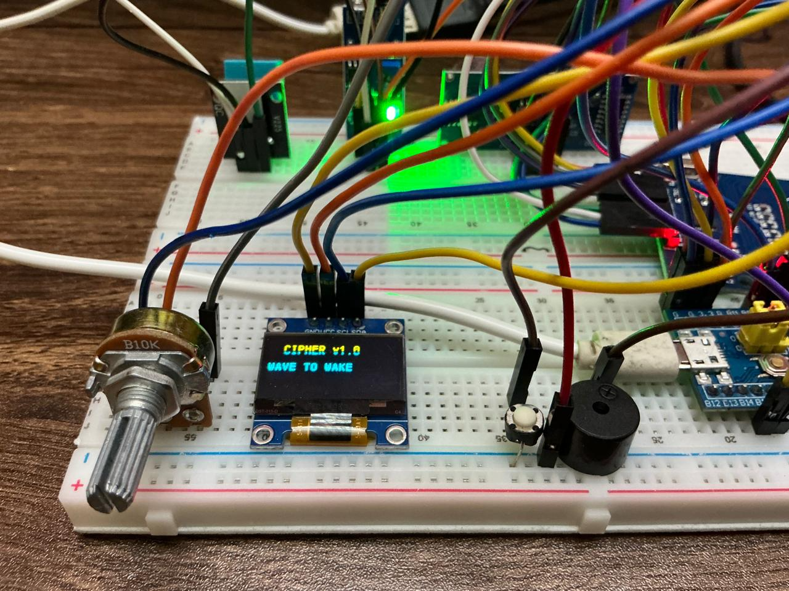 |
| 2 | Player waves a hand → IR triggers → OLED prompts for RFID card | 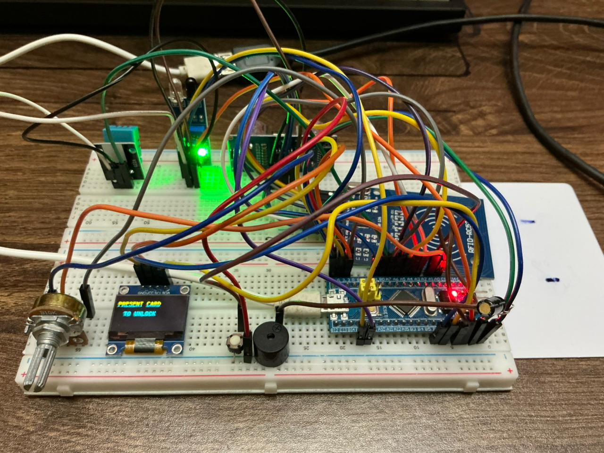 |
| 3 | Player scans card → RC522 detects → brief "unauthorized intrusion detected" flavour screen | 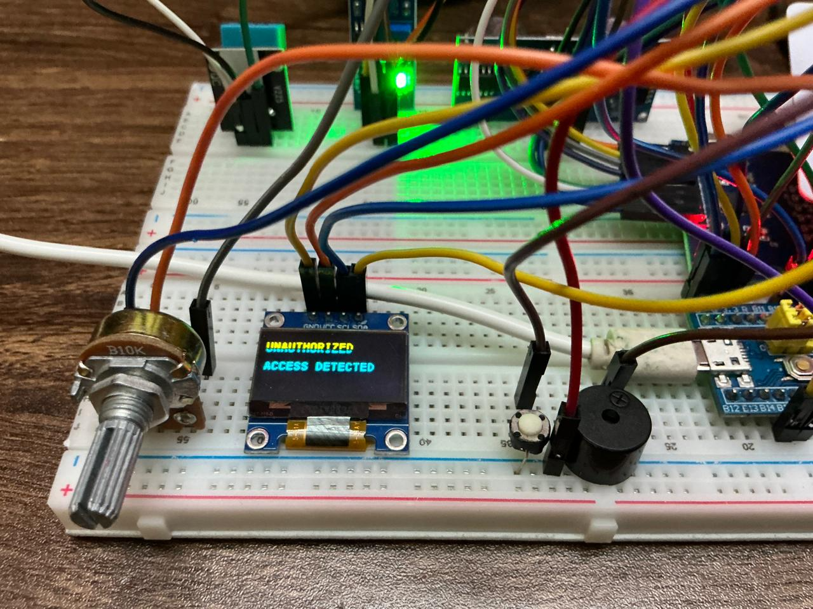 |
| 4 | System "accepts" the breach → countdown begins → OLED shows "HACK INITIATED 90s" | 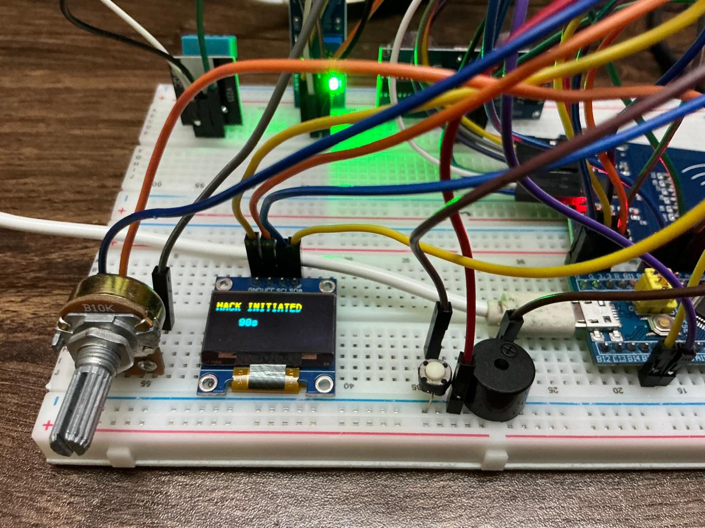 |
| 5 | Game loop starts — TIM2 ISR begins decrementing the countdown |  |

The randomizer is seeded at this point by combining the system tick counter with an ADC sample from the potentiometer, so each run gets a different question set.

---

## The Six Stages

The player has 90 seconds and 3 lives to clear all six. A wrong answer costs a life. A correct answer plays a pass tone and advances.

### Stage 1 — Calculus Dial-In

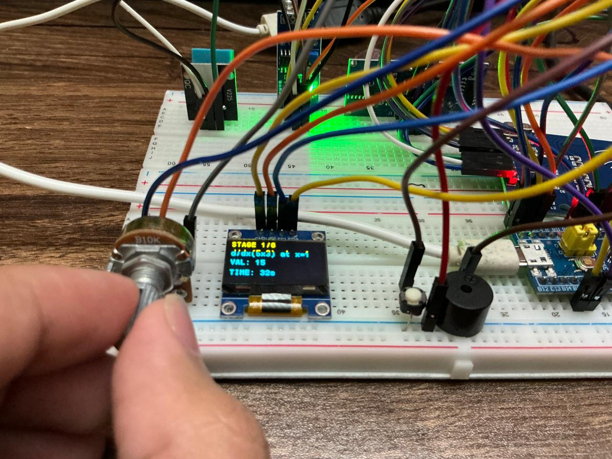

The OLED shows a calculus question (derivatives, integrals, evaluated limits) drawn at random from an in-firmware question bank. The player turns the potentiometer; the live value is rendered on screen in real time as `VAL: NN`. Pressing the push button confirms the answer.

- **Input:** Potentiometer (PA0, ADC1_IN0)
- **Confirm:** Push button (PA1)
- **Tolerance:** ±2 on the answer value
- **Random pool:** 5 questions per run

### Stage 2 — Algebra Dial-In

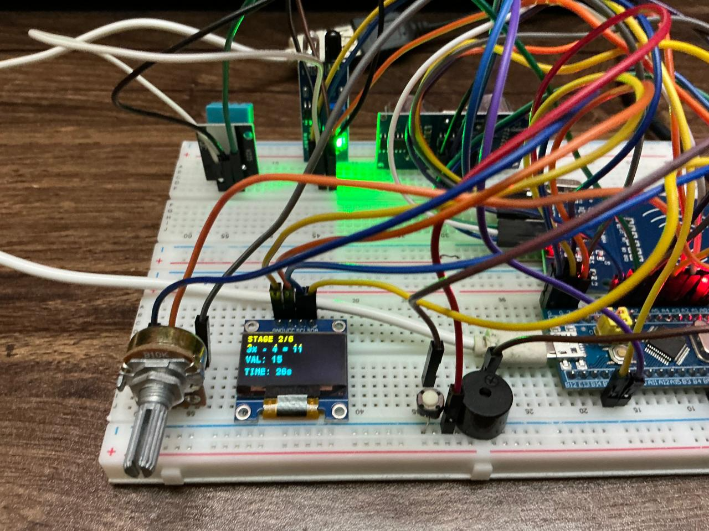

Same mechanic as Stage 1 but drawn from a separate algebra question bank — typically targeting different ranges of the potentiometer travel, so the player can't rely on muscle memory from the previous stage.

- **Input:** Potentiometer (PA0)
- **Confirm:** Push button (PA1)
- **Tolerance:** ±2
- **Random pool:** 5 questions per run

### Stage 3 — Ultrasonic Distance Challenge

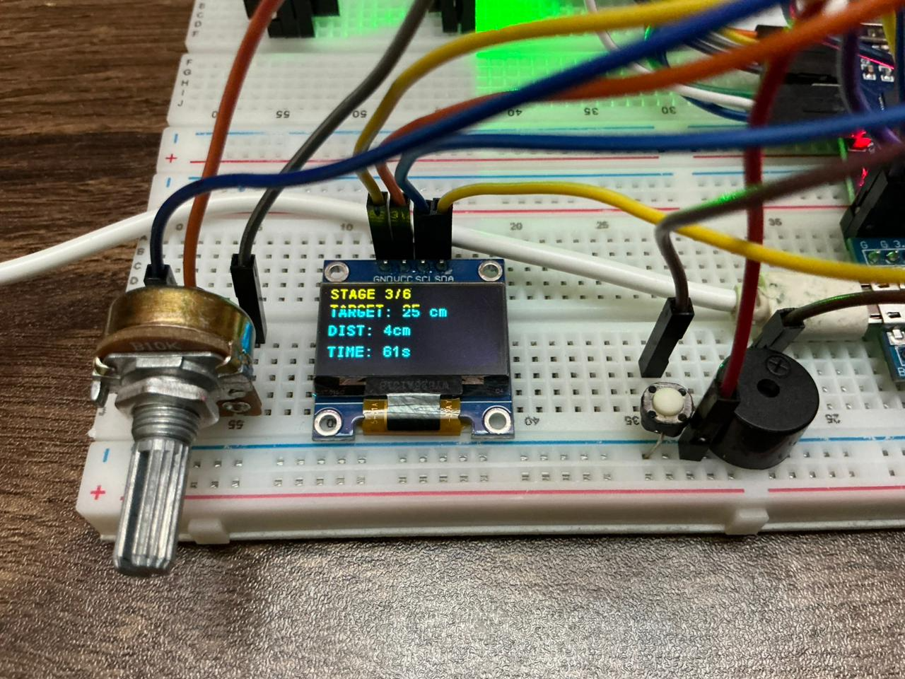

The OLED shows a randomly generated target distance (e.g. "TARGET: 15 cm"). The HC-SR04 reads continuously and the live distance is displayed alongside. When the player's hand or a flat object is within ±2 cm of the target, pressing the button clears the stage.

- **Input:** HC-SR04 (PB1 TRIG, PA8 ECHO)
- **Confirm:** Push button (PA1)
- **Tolerance:** ±2 cm
- **Random target pool:** 4 distances per run

Timing uses the ARM DWT cycle counter rather than the more conventional Input Capture approach — see [Hardware Bring-Up Tests](#hardware-bring-up-tests) for why.

### Stage 4 — Timed Button Hold

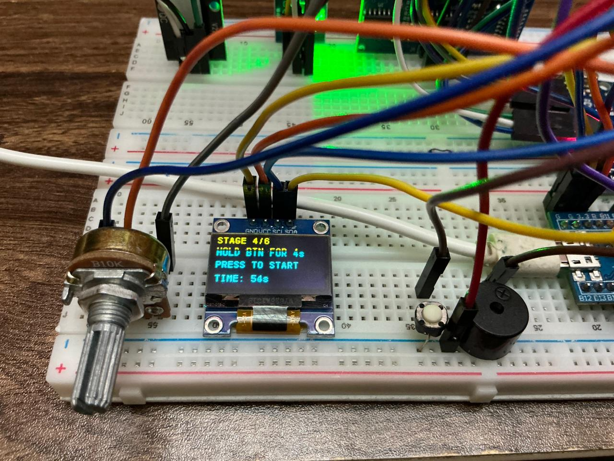

The OLED shows a target hold duration (4 seconds). The player presses and holds the push button; a live counter (`HELD: 2.4s`) updates 10 times per second. Releasing within ±1.5 seconds of the target clears the stage.

- **Input:** Push button (PA1) — held
- **Tolerance:** ±1500 ms

### Stage 5 — Temperature Challenge

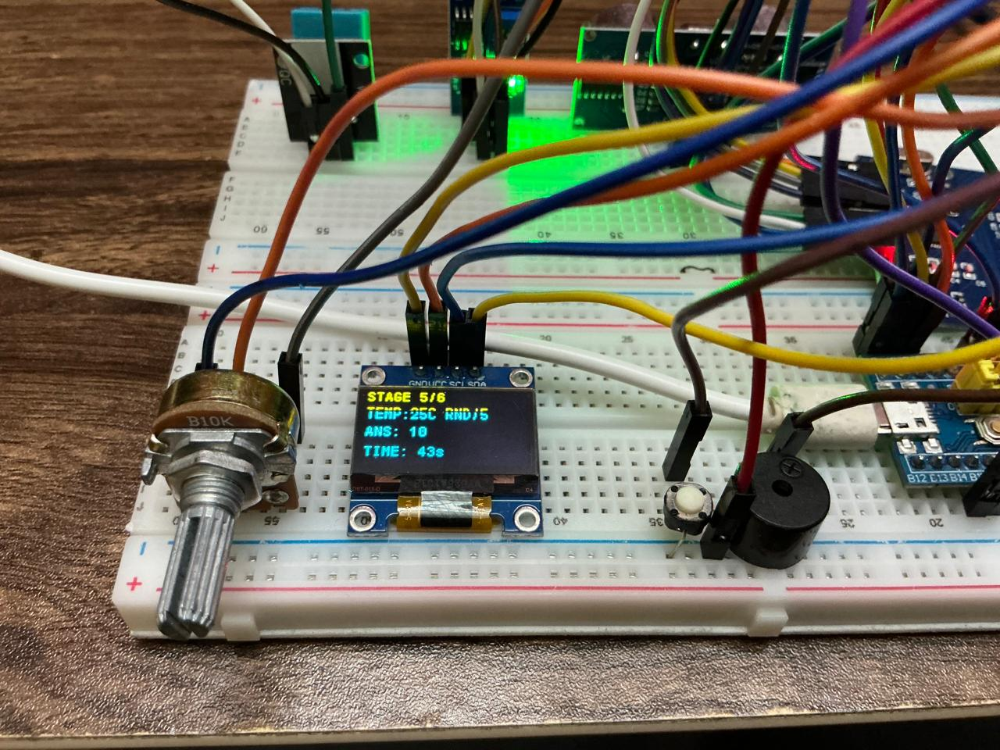

The DHT11 reads ambient room temperature. The OLED displays the reading (`TEMP: 27C`) and instructs the player to round it to the nearest 5. The player dials in the answer using the potentiometer and confirms.

- **Input:** DHT11 (PB0), Potentiometer (PA0)
- **Confirm:** Push button (PA1)
- **Tolerance:** exact match on the rounded value

**Graceful fallback:** If the DHT11 doesn't respond — missing pull-up, faulty unit, or wiring issue — `dht11_read()` returns 0 and Stage 5 falls back to a default temperature of **25°C**. The stage remains fully playable: the OLED simply shows 25°C and the answer (rounded to the nearest 5) is 25. This was a deliberate design choice so a single flaky sensor never blocks the rest of the demo.

### Stage 6 — Dual-Dial Passcode

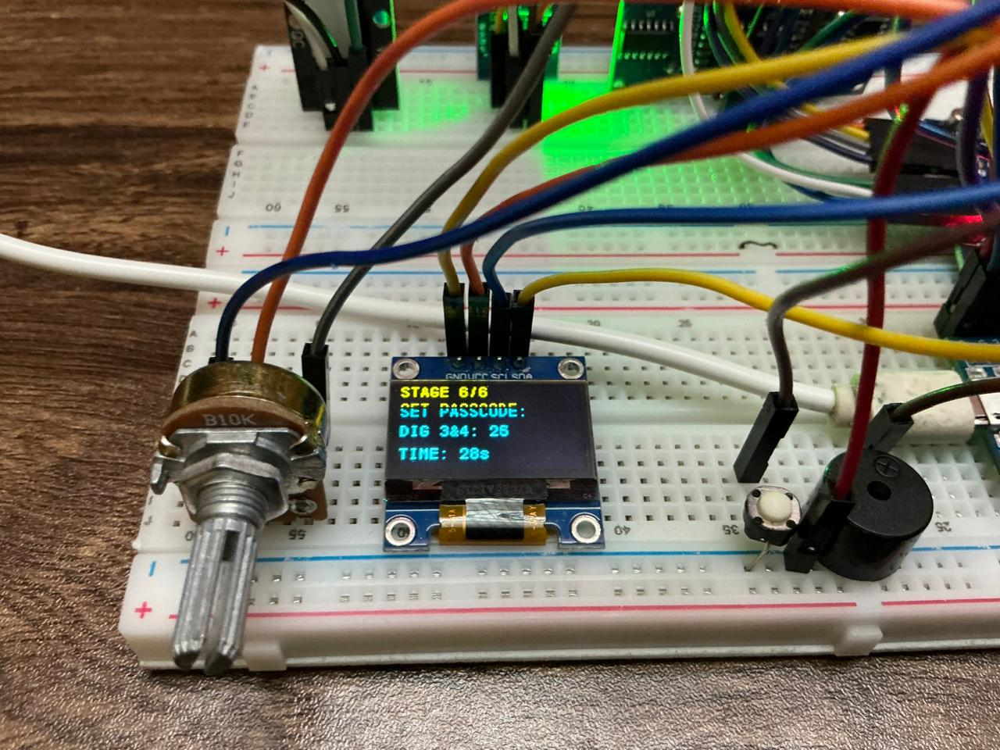

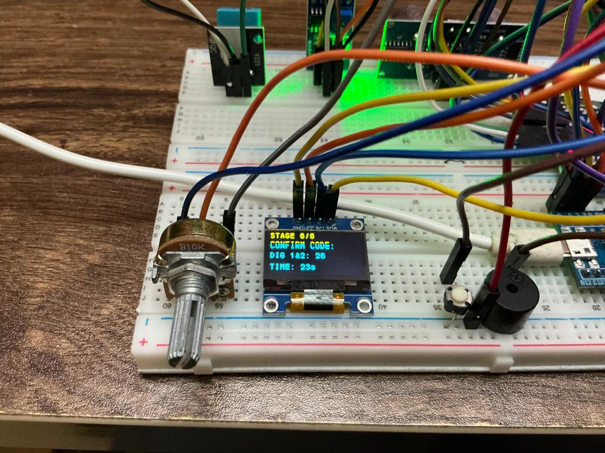

The player sets a 4-digit passcode in two phases:
1. **SET phase:** Dial the first two digits (range 10–99) on the potentiometer and confirm → dial the last two digits (range 0–99) and confirm
2. **CONFIRM phase:** Repeat the same two dial-ins. If both match within ±2 on each pair, the stage clears.

This stage exists to test memory plus motor recall — the player has to remember a 4-digit code and reproduce it with the same dial movements under time pressure.

- **Input:** Potentiometer (PA0) — two-phase
- **Confirm:** Push button (PA1) per phase
- **Tolerance:** ±2 per dial input

---

## Win & Fail States

### Stage passed

After each correct answer, the OLED briefly displays a confirmation before advancing to the next stage.

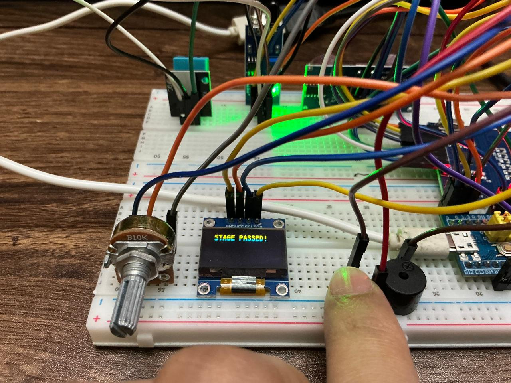

### Access granted (win)

Clear all six stages within 90 seconds → win tone + unlock screen.

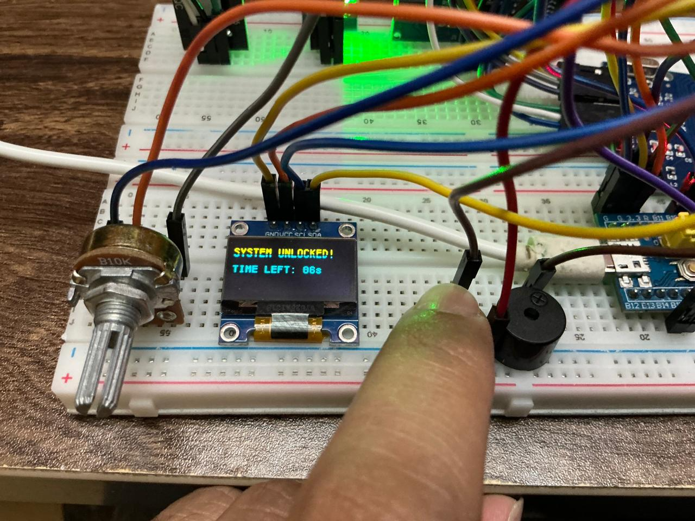

### Access denied (fail)

Three failed attempts, or countdown reaches zero → fail tone + reset.

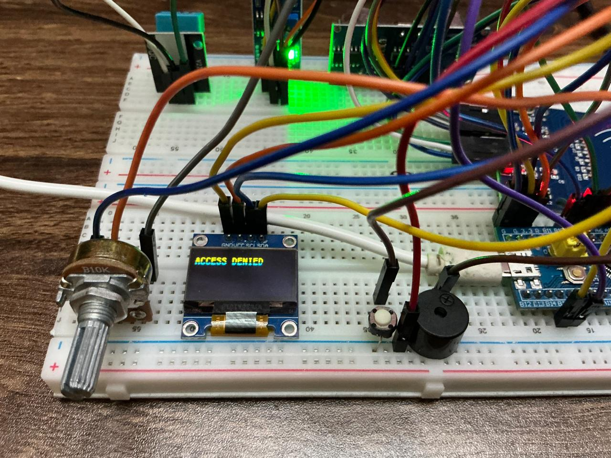

The system automatically returns to the boot screen after a fail, with a new randomized question set.

---

## Development Screens

During development, a debug overlay was added that briefly surfaces internal state (including the generated passcode for Stage 6) for testing purposes. It's not part of the production game flow but is included here for completeness — and because it's an example of why ADC-seeded RNG actually produces a different code on every reset.

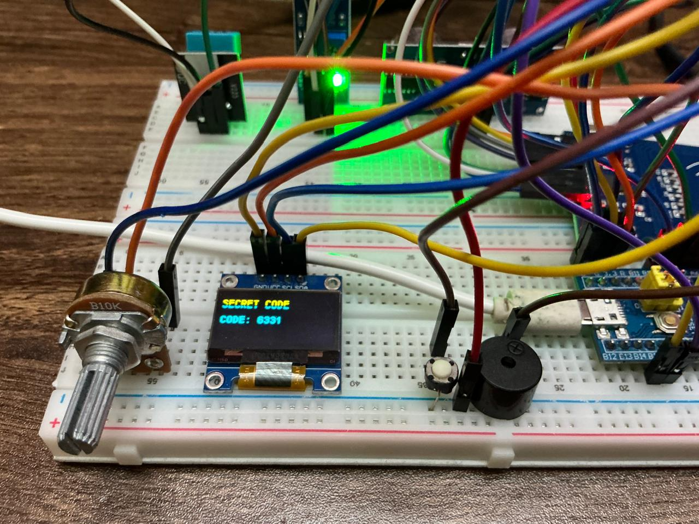

---

## Hardware Bring-Up Tests

Two of the harder-to-debug peripherals — the HC-SR04 ultrasonic sensor and the SSD1306 OLED — were brought up in standalone test projects before being integrated into the main CIPHER firmware. Both projects are included in this repo with their own READMEs, prebuilt binaries, and CubeMX configuration screenshots so you can reproduce or reuse them independently.

| Project | Purpose | Location |
|---|---|---|
| [`hardware_tests/hcsr04_test/`](hardware_tests/hcsr04_test/) | Isolate the HC-SR04 sensor to verify timing approach (DWT GPIO polling vs Input Capture). Originally written to debug Stage 3; the fix was ported back into CIPHER. | [README](hardware_tests/hcsr04_test/README.md) |
| [`hardware_tests/oled_test/`](hardware_tests/oled_test/) | Confirm the SSD1306 OLED + Lutsai driver + I2C Fast Mode combination. Originally written when an alternate OLED library failed silently; the working library was then adopted for CIPHER. | [README](hardware_tests/oled_test/README.md) |

These also double as useful "minimum viable example" projects if you want to use either sensor on a Blue Pill in your own work.

---

## Pin Reservations & Expansion

A handful of GPIO pins are pre-configured in the CubeMX project but left **unconnected** in the default CIPHER build. These are reserved for an optional **4×4 matrix keypad input** expansion — useful if you'd like to replace the dial-in mechanic in Stage 5 or 6 with typed numeric input, or add a typed passcode mode without rewriting the input handler.

| Pin | Mode | Pull | Intended role |
|---|---|---|---|
| PA9 | GPIO_EXTI9 | Pull-down | Keypad column 1 |
| PA10 | GPIO_EXTI10 | Pull-down | Keypad column 2 |
| PA11 | GPIO_EXTI11 | Pull-down | Keypad column 3 |
| PA12 | GPIO_EXTI12 | Pull-down | Keypad column 4 |
| PB2 | GPIO_Output | — | Keypad row 1 |
| PB8 | GPIO_Output | — | Keypad row 2 |
| PB10 | GPIO_Output | — | Keypad row 3 |
| PB11 | GPIO_Output | — | Keypad row 4 |
| PB12 | GPIO_Output | — | Keypad row 5 (spare) |
| PB13 | GPIO_Output | — | Keypad row 6 (spare) |
| PB14 | GPIO_Output | — | Keypad row 7 (spare) |

A working `scan_keypad()` function is already present in `main.c`, including 4×4 column/row scan logic with debouncing and a standard `0–9`, `*`, `#` character map. To enable typed input:

1. Wire a 4×4 matrix keypad to the row/column pins above (cols use the internal pull-downs, no external resistors needed)
2. Call `scan_keypad()` from the stage handler you want to extend
3. Wire the returned character into the OLED display + answer-check logic the same way `read_pot()` is used for the dial-in stages

This was originally an alternative input modality during prototyping; the dial-in mechanic ended up giving a better tactile feel for the game, so the keypad path remained in the firmware as a documented expansion point rather than being removed.

---

## How to Flash

The prebuilt firmware is at the repo root: [`cipher.bin`](cipher.bin).

### Option A — Mac (ST-LINK V2 plugged directly into USB-C port via adapter, not a hub)

```bash
/opt/ST/STM32CubeCLT_*/STM32CubeProgrammer/bin/STM32_Programmer_CLI \
  -c port=SWD -w cipher.bin 0x08000000 -rst
```

> ST-LINK V2 doesn't enumerate reliably through USB hubs on M-series Macs. The green LED lights up (5 V passes) but the OS doesn't see the device. Use a direct USB-A → USB-C adapter into the laptop.

### Option B — Windows

1. Install **STM32CubeProgrammer** (free, from st.com)
2. Connect ST-LINK V2 → Blue Pill via SWD:

   | ST-LINK V2 | Blue Pill |
   |---|---|
   | SWDIO | PA13 |
   | SWCLK | PA14 |
   | GND | GND |
   | 3.3 V | 3V3 |

3. Open STM32CubeProgrammer → Connect → Open File → select `cipher.bin` → Download at `0x08000000`

### After flashing

- Set the BOOT0 jumper to the **0 side** (toward the USB connector) — normal run mode
- **Disconnect** ST-LINK and power the Blue Pill from its micro-USB port — this provides 5 V on the 5V pin for the HC-SR04 and IR sensor

---

## How to Rebuild from Source

The full source tree is in [`cipher_project/`](cipher_project/).

```bash
cd cipher_project
cmake -B build -DCMAKE_TOOLCHAIN_FILE=cmake/gcc-arm-none-eabi.cmake -DCMAKE_BUILD_TYPE=Debug
cmake --build build
```

Output: `cipher_project/build/cipher.bin`

### Build prerequisites
- **STM32CubeCLT** (ARM GCC + CubeProgrammer CLI) — free from st.com
- **STM32CubeMX** — only needed if you want to regenerate code from the `.ioc`
- **CMake** ≥ 3.22

### Tested toolchain
| Component | Version |
|---|---|
| STM32CubeCLT | 1.21.0 |
| ARM GCC | 14.3.1 |
| CMake | 3.22+ |
| STM32CubeMX | 6.17 |
| HAL package | STM32Cube_FW_F1 V1.8.7 |

### Known CubeMX gotchas (after running *Generate Code*)

1. **Re-add manual sources in `cmake/stm32cubemx/CMakeLists.txt`** — CubeMX wipes them on each regen. The required entries are:
   ```cmake
   ${CMAKE_CURRENT_SOURCE_DIR}/../../Core/Src/ssd1306.c
   ${CMAKE_CURRENT_SOURCE_DIR}/../../Core/Src/fonts.c
   ${CMAKE_CURRENT_SOURCE_DIR}/../../Core/Src/rc522.c
   ```
2. **Don't accept the auto clock-solver dialog** — it resets PLLMul to ×2. Set PLLMul = ×9, HCLK = 72 manually.
3. **CMake toolchain flag** — always pass `-DCMAKE_TOOLCHAIN_FILE=cmake/gcc-arm-none-eabi.cmake`, otherwise CMake picks up Apple Clang on macOS and fails on ARM-specific intrinsics.

---

## Build Metrics

| Metric | Value |
|---|---|
| MCU | STM32F103C8T6 (Blue Pill) |
| Clock | 72 MHz (HSE 8 MHz × PLL ×9) |
| Flash usage | 35,524 B / 64 KB (54%) |
| RAM usage | 4,112 B / 20 KB (20%) |
| Countdown | 90 seconds |
| Lives | 3 per game |
| Stages | 6 |
| Build system | CMake + ARM GCC 14.3.1 |
| Build status | Zero errors, zero warnings |

---

## Known Limitations

These are documented honestly so a future fork (or future me) knows what to look at.

- **DHT11 read flakiness:** Some DHT11 units fail to respond on first read after power-up, or stop responding intermittently. The current `dht11_read()` does not retry; instead, Stage 5 falls back to a default temperature of 25°C as described in [Stage 5](#stage-5--temperature-challenge). A retry loop with longer inter-read spacing would likely fix this cleanly.
- **Buzzer transition melodies (stage pass / fail):** The current implementation sequences PWM frequencies inline with `HAL_Delay()`, which produces garbled output because the PWM peripheral doesn't latch the new frequency until the next period. A timer-driven note queue would solve this; the current code just plays single notes for the major events instead.
- **Buzzer ticking under 15 seconds:** The intended "escalating tick" effect during the last 15 seconds of the countdown is partly inaudible because most stage handlers block in `HAL_Delay()` while waiting for sensor input. Moving the buzzer drive into the TIM2 ISR (where the countdown already lives) would fix this.
- **ST-LINK through USB hubs:** Confirmed not reliable on M-series Macs. Use a direct USB-A → USB-C adapter.
- **RFID on breadboard:** Unreliable; direct male-to-female wires + 100 nF decoupling cap is the verified workaround.

---

## License

MIT — see the [LICENSE](LICENSE) file. Free for educational reuse, including the bring-up test projects.

## Author

GitHub: [asifulshiam](https://github.com/asifulshiam)
